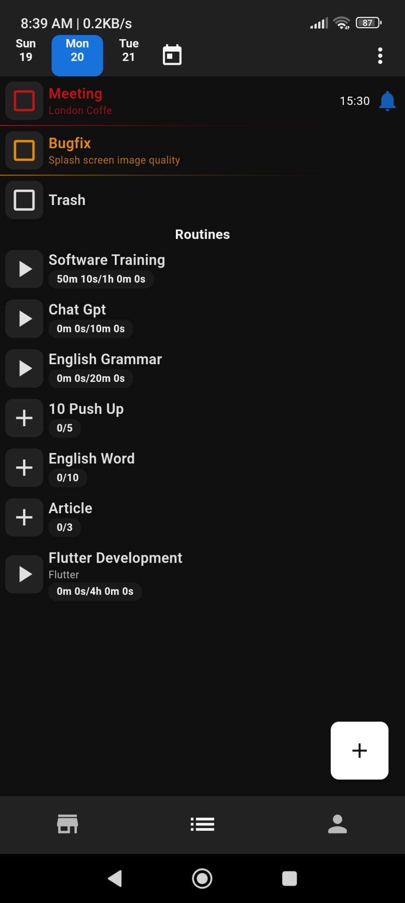
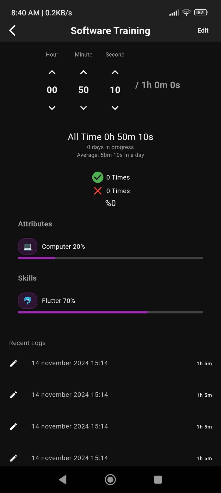
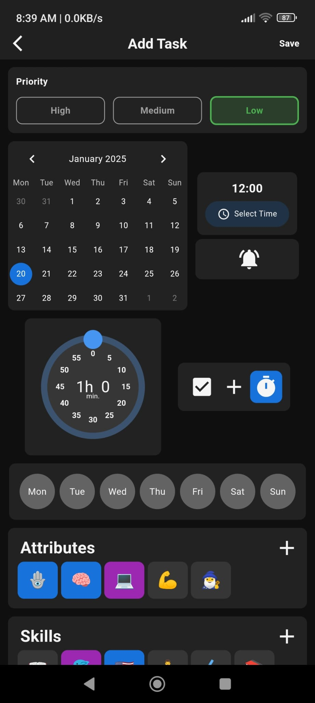
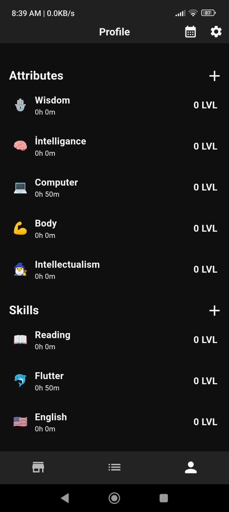
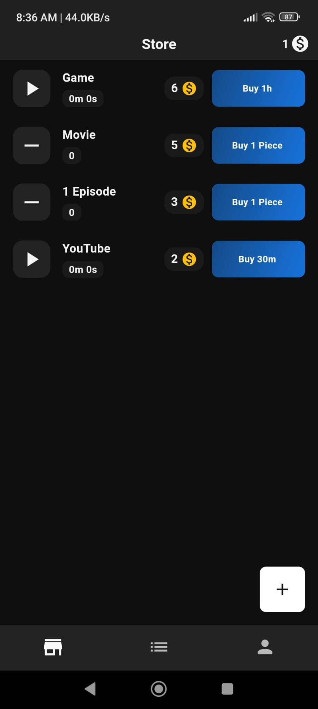

# NextLevel

Gamified to-do list app

Flutter, Node.js, PostgreSQL, Figma, Postman, Heroku, Notion.

### Home & Routine Detail

  
  

### Add Task and Trait Detail

  
  

### Profile and Store

  
  

